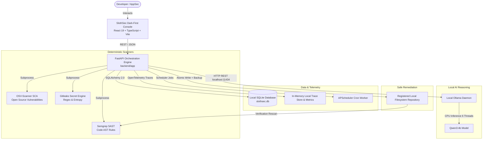
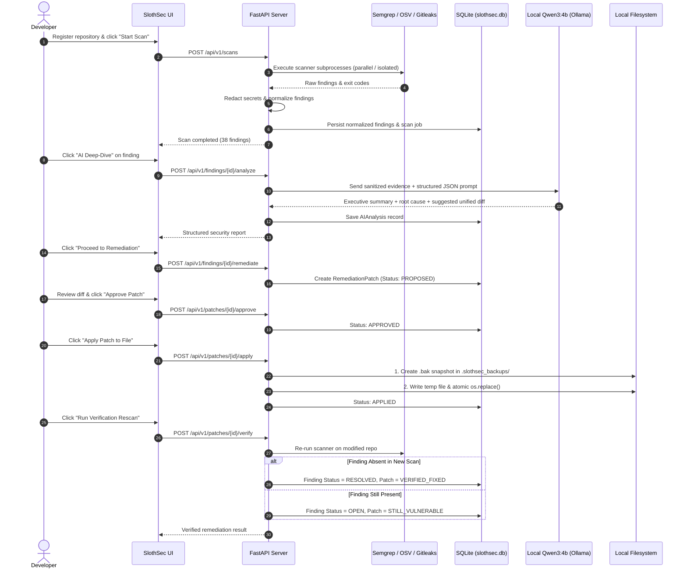

# Architecture & Data Flow — SlothSec

## 1. High-Level Architecture Diagram

```mermaid
graph TD
    User([Developer / AppSec]) -->|Interacts| UI[SlothSec Dark-First Console\nReact 19 + TypeScript + Vite]
    UI -->|REST / JSON| API[FastAPI Orchestration Engine\nbackend/app]

    subgraph Deterministic Scanners
        API -->|Subprocess| SG[Semgrep SAST\nCode AST Rules]
        API -->|Subprocess| OSV[OSV-Scanner SCA\nOpen Source Vulnerabilities]
        API -->|Subprocess| GL[Gitleaks Secret Engine\nRegex & Entropy]
    end

    subgraph Data & Telemetry
        API -->|SQLAlchemy 2.0| DB[(Local SQLite Database\nslothsec.db)]
        API -->|OpenTelemetry Traces| OTEL[In-Memory Local Trace Store & Metrics]
        API -->|Scheduler Jobs| APS[APScheduler Cron Worker]
    end

    subgraph Local AI Reasoning
        API -->|HTTP REST localhost:11434| Ollama[Local Ollama Daemon]
        Ollama -->|CPU Inference 6 Threads| Qwen[Qwen3:4b Model]
    end

    subgraph Safe Remediation
        API -->|Atomic Write + Backup| Repo[Registered Local Filesystem Repository]
        Repo -->|Verification Rescan| SG
    end
```

## 2. End-to-End Remediation Data Flow

```mermaid
sequenceDiagram
    autonumber
    actor Dev as Developer
    participant UI as SlothSec UI
    participant Backend as FastAPI Server
    participant Scanners as Semgrep / OSV / Gitleaks
    participant DB as SQLite (slothsec.db)
    participant AI as Local Qwen3:4b (Ollama)
    participant FS as Local Filesystem

    Dev->>UI: Register repository & click "Start Scan"
    UI->>Backend: POST /api/v1/scans
    Backend->>Scanners: Execute scanner subprocesses (parallel / isolated)
    Scanners-->>Backend: Raw findings & exit codes
    Backend->>Backend: Redact secrets & normalize findings
    Backend->>DB: Persist normalized findings & scan job
    Backend-->>UI: Scan completed (38 findings)

    Dev->>UI: Click "AI Deep-Dive" on finding
    UI->>Backend: POST /api/v1/findings/{id}/analyze
    Backend->>AI: Send sanitized evidence + structured JSON prompt
    AI-->>Backend: Executive summary + root cause + suggested unified diff
    Backend->>DB: Save AIAnalysis record
    Backend-->>UI: Structured security report

    Dev->>UI: Click "Proceed to Remediation"
    UI->>Backend: POST /api/v1/findings/{id}/remediate
    Backend->>DB: Create RemediationPatch (Status: PROPOSED)

    Dev->>UI: Review diff & click "Approve Patch"
    UI->>Backend: POST /api/v1/patches/{id}/approve
    Backend->>DB: Status: APPROVED

    Dev->>UI: Click "Apply Patch to File"
    UI->>Backend: POST /api/v1/patches/{id}/apply
    Backend->>FS: 1. Create .bak snapshot in .slothsec_backups/
    Backend->>FS: 2. Write temp file & atomic os.replace()
    Backend->>DB: Status: APPLIED

    Dev->>UI: Click "Run Verification Rescan"
    UI->>Backend: POST /api/v1/patches/{id}/verify
    Backend->>Scanners: Re-run scanner on modified repo
    alt Finding Absent in New Scan
        Backend->>DB: Finding Status = RESOLVED, Patch = VERIFIED_FIXED
    else Finding Still Present
        Backend->>DB: Finding Status = OPEN, Patch = STILL_VULNERABLE
    end
    Backend-->>UI: Verified remediation result
```
